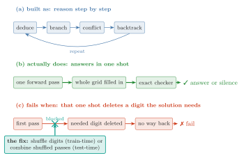

# CoLT — Conflict-driven Lattice Transformer

**New architecture research** by the team behind the [ad3002/gram](https://github.com/ad3002/gram)
(GRAM, arXiv:2605.19376) and [ad3002/LTD](https://github.com/ad3002/LTD)
(LDT, arXiv:2605.08605) reimplementations. CoLT puts **learned search** —
a branch-policy head, value-guided conflict detection, chronological DFS
backtracking with a verified-nogood memory, a CDCL-inspired toolkit (no
conflict analysis: leaf-level nogoods only) — **inside LDT's sound deduction
envelope**, and replaces per-size positional tables with **constraint-graph
attention**: one checkpoint spans the boards it is trained on (4×4/6×6 here),
and its local propagator transfers zero-shot to 9×9.

> The full rationale is in [`DESIGN.md`](DESIGN.md); the frozen (committed-before-execution)
> protocol in [`BENCHMARKS.md`](BENCHMARKS.md); the GPU plan in
> [`PHASE4.md`](PHASE4.md). The two companion manuscripts are maintained separately and will appear on arXiv.

## The paper in one picture



## Why

Our LDT reproduction measured exactly where sound lattice deduction wastes its
compute: on the puzzles it failed, the solver **re-generated the same wrong
completions tens of thousands of times** (35,200 suppressed wrong grids
concentrated on 11/300 puzzles at 4×4; 148,567 at 6×6) — the soundness guard
fires, but the search is blind: random branch cells, restart-from-scratch on
conflict, no information shared between chains. Soundness in LDT is enforced
*at emission* (verify-or-abstain), not by the search policy — which licenses
arbitrarily smart learned search at zero risk to the guarantee.

## Results (frozen budgets, identical data vs baselines; 1× RTX 4090, minutes per run)

Raw JSONs in [`results/`](results/); protocol in [`BENCHMARKS.md`](BENCHMARKS.md);
full write-up in the companion manuscripts (arXiv, forthcoming). Train/test splits are
audited for leakage up to the full Sudoku symmetry group
([`scripts/leakage_audit.py`](scripts/leakage_audit.py),
[`results/leakage_audit.json`](results/leakage_audit.json)): the 9×9 splits are clean at
every level (puzzles, solutions, digit orbits, full orbits); 4×4/6×6 symmetry-class overlap
is forced by those domains' tiny class counts (2 and ~49 essential grids) and those tiers
are read accordingly. Revision experiments are frozen (committed before execution) in
[`REVISION_EXPERIMENTS.md`](REVISION_EXPERIMENTS.md).

### Headline — 6×6 test, 32 chains × 60 rounds, identical puzzles every row

| system | accuracy | soundness | wrong answers emitted |
|---|---|---|---|
| GRAM (matched budget; no abstention) | 0.0–1.1% (two runs; stochastic emission) | — | **98.9–100% of answers** |
| LDT baseline (ad3002/LTD) | 49.4% | 100% | 0 |
| **CoLT (this work)** | **100.0%** | **100%** | **0** |

**+50.6 pp over LDT at equal budget (canonical checkpoint, one measurement environment) — and the decomposition is the story:**

1. **Constraint-graph attention carries the gain — measured, not presumed.**
   The prospectively specified six-arm single-component ablation (E8, three seeds, one
   environment; `results/ablate6_*.json`) puts the graph-bias-only arm at
   **99.4%** std on every seed where positional-table and coordinate-only
   controls sit at **0.0%** on every seed — gap fraction mean exactly 1.00.
   Every graph-bias arm hits probe 1.0 by step 1,000; every arm without it
   never leaves 0. A seed-42 hint that dropping the policy loss helps the hard
   slice did not replicate (reported with its non-replication).
2. **DFS + nogoods is a pure efficiency win**: the standard slice leaves nothing
   to cut (zero suppressed completions in all six arms), and on the hard 14-clue
   slice wasted wrong-completion derivations drop **74,864 → 50** (1,497×) at
   identical accuracy — three orders of magnitude less verification waste under
   the verify-or-abstain regime.
3. **The learned branch policy is inert at 6×6** (honest null result): the
   benchmark bifurcates — puzzles fall to propagation in ≤5 rounds or resist
   every search arm.
4. **Failure anatomy is a perfect dichotomy**: all 43 failures — and only the
   failures — are *first-pass poisoned* (the propagator confidently eliminates a
   true-solution value in its first forward pass; θ-insensitive). The frontier
   is propagator calibration, not search.

### One checkpoint across the trained boards (multi-task over the constraint graph)

| | 4×4 | 6×6 | 9×9 (zero-shot) |
|---|---|---|---|
| single-size ckpts | 100.0% | 98.9% | — |
| **one multi-size ckpt** | **100.0%** | **99.4%** | elimination transfers: **precision 0.977 @ recall 0.60**; global heads don't (AUC 0.50) |

Multi-task training matched single-size 6×6 within one puzzle in 180 (99.4 vs 98.9) —
criterion "no degradation" passed; no positive-transfer claim at this resolution.

### Phase 4 — 9×9 at 25 clues (frozen budget 64×200; same data every row)

| system | accuracy | emitted | soundness | suppressed wrong completions |
|---|---|---|---|---|
| CoLT, no augmentation (restart) | 0.0% | 0/180 | — (undefined, 0 emitted) | 1,119,853 |
| CoLT, no augmentation (DFS+nogoods) | 0.0% | 0/180 | — (undefined, 0 emitted) | **91** |
| LDT reimpl., no augmentation | 0.0% | 0/180 | — (undefined, 0 emitted) | 1,841,396 |
| **CoLT + digit-permutation augmentation** | **96.1%** | 173/180 | **100%** | **0** |

The soundness *rate* (correct/emitted) is undefined for all-abstain rows; the
verified-emission invariant (no invalid grid ever emitted) holds in every row.

The failure-anatomy probe predicted its own cure: the 9×9 wall is *first-pass
poisoning* (confident value-specific mis-eliminations), and a single exact data
symmetry — a random digit permutation per training trajectory — takes the same
architecture, data, and budget from **0% to 96.1%** (median 1 forward pass per
solve, zero suppressed completions). Honest caveat: the LDT *paper's* full
recipe includes this augmentation; the LDT row is our reimplementation without
it (its documented top deviation), trained at batch 256 (paper batch 512 OOMs
a 24 GB card under full-unroll BPTT). Protocol details: [`PHASE4.md`](PHASE4.md).

### The diagnosis, completed (H1 / H2 / 2×2)

- **H1 — in the clue-rich regime these are one-shot solvers.** A single forward
  pass commits *every* blank of *every* standard-slice puzzle to a singleton
  (rate 1.000). There, the "deduction loop" is a sound verifier around an
  amortized guesser — which is why search ablations were flat (on from-scratch
  coloring the singleton rate drops to 1.4% and the loop genuinely iterates).
- **H2 — test-time cure, no retraining.** Union-ensembling each forward over
  K=8 digit-permutation frames (keep a candidate if *any* frame keeps it):
  poisoning 23.9% → **1.7%**, hard-slice accuracy 76.1% → **100%**. Mean
  aggregation reaches 97.8% — the union is the active anti-poisoning
  ingredient, as designed.
- **2×2 confound resolved with an interaction:** at the frozen budget,
  augmentation *collapses* the positional-table baseline (49.4% → **0.0%**;
  destruction vs slowed convergence is separated by the extended-budget arm
  E1) and is free for the graph-bias model (98.9% → **100.0%**).
  Constraint-graph conditioning is what makes augmentation affordable.

## Layout

```
colt/
├── DESIGN.md            ← architecture rationale (Phase 0)
├── BENCHMARKS.md        ← frozen datasets, budgets, baselines, success criteria
├── PHASE4.md            ← GPU head-to-head requirements + protocol
├── colt/
│   ├── blocks.py        ← RMSNorm/SwiGLU + relational (constraint-graph) attention
│   ├── lattice.py       ← candidate-set lattice + α-operator (from ad3002/LTD)
│   ├── model.py         ← size-agnostic recurrent reasoner, 3 heads (cand/conflict/policy)
│   ├── losses.py        ← LDT Eq.1 + branch-policy BCE
│   ├── solve.py         ← TrainPool + restart solver + DFS/backjump/nogood solver
│   ├── train.py         ← multi-task pool training CLI
│   ├── eval.py          ← ablation-grid eval CLI (--search × --policy)
│   └── tasks/sudoku.py  ← geometry, constraint graph, verifier, TSV loader
├── configs/             ← colt6.yaml (Phase 1/2), colt_multi.yaml (Phase 3)
├── scripts/             ← dataset builder, GRAM converter, 9×9 transfer probe
└── tests/               ← unit tests
```

## Quick start

```bash
pip install -e ".[dev]"
PYTEST_DISABLE_PLUGIN_AUTOLOAD=1 pytest -q

# Phase 1/2: train on 6×6, then run the full ablation grid from ONE checkpoint
python -m colt.train --config configs/colt6.yaml --dataset data/sudoku6 \
    --output-dir runs/colt6 --device cpu --eval-every 1000
for s in restart dfs; do for p in random mrv learned; do
  python -m colt.eval --checkpoint runs/colt6/final.pt --split data/sudoku6/test.tsv \
      --search $s --policy $p --n-chains 32 --max-rounds 60 \
      --output results/colt6_${s}_${p}.json
done; done
```

## License

MIT. If you build on this, cite the GRAM and LDT papers and this repository
(`CITATION.cff`).
